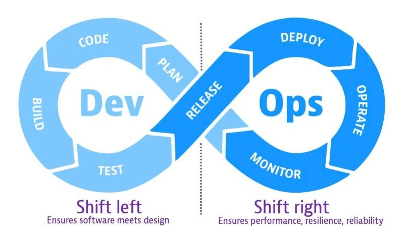
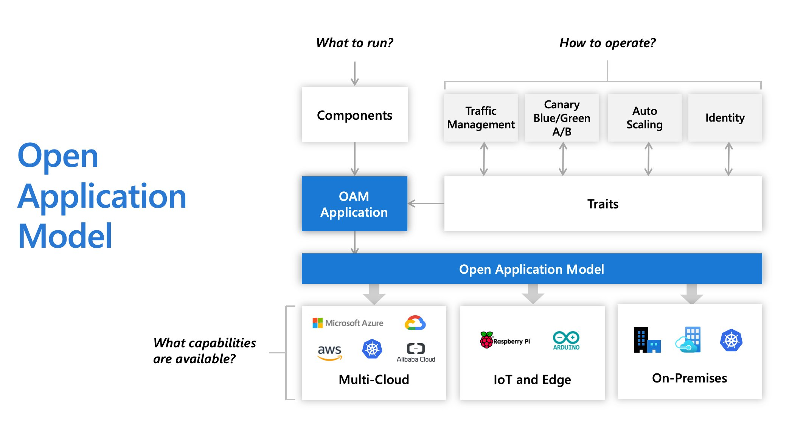
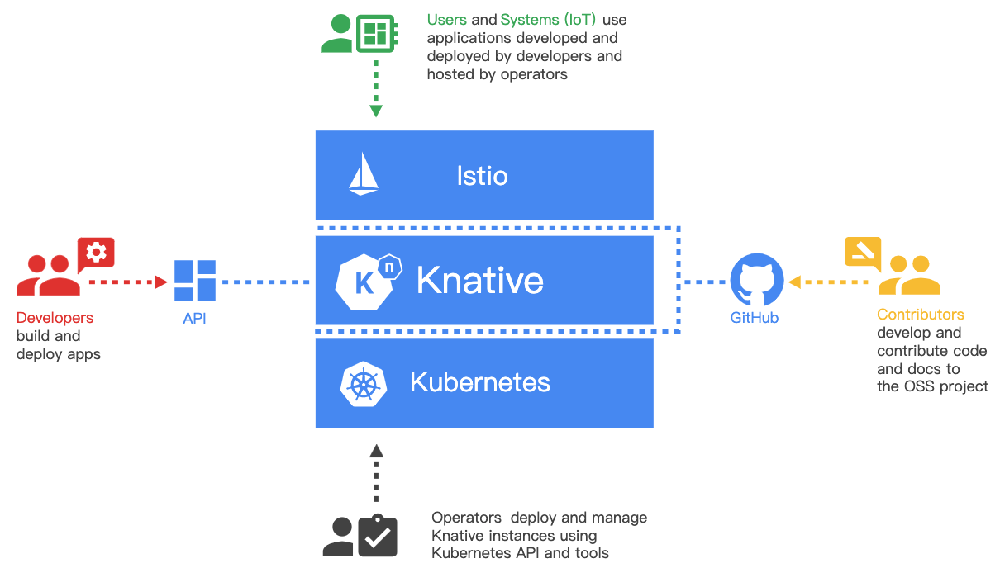

# Cloud-Native Application Definition

## Terminology

### Shift Left & Shift Right

To understand **shift left** and **shift right**, consider the software development cycle as a continuum, or infinity loop, from left to right. On the left side of the loop, teams plan, develop, and test software in pre-production. The main concern in pre-production on the left side of the loop is building software that meets design criteria. When teams release software into production on the right side of the loop, they make the software available to users. The concern in production is to maintain software that meets business goals and reliability criteria.



**Shift-left** is the practice of moving testing, quality, and performance evaluation early in the software development process, thus the process of shifting to the “left” side of the DevOps lifecycle. This concept has become increasingly important as teams face pressure to deliver software faster and more frequently with higher quality. **Shift-left** speeds up development efficiency and reduces costs by detecting and addressing software defects earlier in the development cycle before they get to production.

**Shift–right** is the practice of performing testing, quality, and performance evaluation in production under real-world conditions. **Shift-right** methods ensure that applications running in production can withstand real user load while ensuring the same high levels of quality. With shift right, DevOps teams test a built application to ensure performance, resilience, and software reliability. The goal is to detect and remediate issues that would be difficult to anticipate in development environments.

Both **shift-left** and **shift-right** testing have become important components of Agile software development, enabling teams to build and release software incrementally and reliably but also test software at various points in the lifecycle.

### Open Application Model (OAM)

Initially created by Microsoft, Alibaba, and Upbound, the **Open Application Model (OAM)** specification describes a model where developers are responsible for defining application components, application operators are responsible for creating instances of those components and assigning them application configurations, and infrastructure operators are responsible for declaring, installing, and maintaining the underlying services that are available on the platform. `Crossplane` and `KubeVela` are some Kubernetes implementations of the specification.

With OAM, platform builders can provide reusable modules in the format of Components, Traits, and Scopes. This allows platforms to do things like package them in predefined application profiles. Users choose how to run their applications by selecting profiles, for example, microservice applications with high service level objective (SLO) requirements, stateful apps with persistent volumes, or event-driven functions with horizontally autoscaling.

The OAM specification introduction document presents a story that explores a typical application delivery lifecycle.

* The developer creates a web application;
* The application operator deploys instances of that application, and configures it with operational traits, such as autoscaling;
* The infrastructure operator decides which underlying technology is used to handle the deployment and operations.



To deliver an application, each individual component of a program is described as a Component YAML by an application developer. This file encapsulates a workload and the information needed to run it.

To run and operate an application, the application operator sets parameter values for the developers’ components and applies operational characteristics, such as replica size, autoscaling policy, ingress points, and traffic routing rules in an ApplicationConfiguration YAML. In OAM, these operational characteristics are called Traits. Writing and deploying an ApplicationConfiguration is equivalent to deploying an application. The underlying platform will create live instances of defined workloads and attach operational traits to workloads according to the ApplicationConfiguration spec.

Infrastructure operators are responsible for declaring, installing, and maintaining the underlying services that are available on the platform. For example, an infrastructure operator might choose a specific load balancer when exposing a service, or a custom database configuration that ensures data is encrypted and replicated globally.

## Models and Tools

### Helm

This is the file Helm uses to create an `application`.

```yaml
replicaCount: 1

image:
  repository: nginx
  pullPolicy: Always
  tag: 1.21.6-alpine

strategy:
  type: RollingUpdate
  rollingUpdate:
    maxUnavailable: 25%
    maxSurge: 1

imagePullSecrets: []
nameOverride: nginx
fullnameOverride: nginx-app

serviceAccount:
  create: true

service:
  type: ClusterIP
  port: 80

ingress:
  enabled: true
  annotations: 
    kubernetes.io/ingress.class: traefik
  hosts:
    - host: localhost
      paths:
        - path: /
          pathType: Prefix

resources:
  limits:
    cpu: 100m
    memory: 128Mi
  requests:
    cpu: 100m
    memory: 128Mi

env:
  - name: CONFIG_FILE
    value: file:/var/app/config/application.yml
  - name: DATABASE_USERNAME
    valueFrom:
      secretKeyRef:
        name: nginx-app
        key: username
  - name: DATABASE_PASSWORD
    valueFrom:
      secretKeyRef:
        name: nginx-app
        key: password

autoscaling:
  enabled: true
  minReplicas: 1
  maxReplicas: 100
  targetCPUUtilizationPercentage: 80
  # targetMemoryUtilizationPercentage: 80

affinity:
  podAntiAffinity:
    preferredDuringSchedulingIgnoredDuringExecution:
      - podAffinityTerm:
          labelSelector:
            matchLabels:
              app.kubernetes.io/name: nginx
              app.kubernetes.io/instance: myapp
          topologyKey: kubernetes.io/hostname
        weight: 100

configMap:
  enabled: true
  data: {}

secret:
  enabled: true
  data: {}
```

Pros:
Cons:

### ArgoCD

This is the file ArgoCD uses to create an `application`.

```yaml
apiVersion: argoproj.io/v1alpha1
kind: Application
metadata:
  name: ngnix-app
  namespace: argocd
  annotations:
    argocd.argoproj.io/sync-wave: "10"
  finalizers:
  - resources-finalizer.argocd.argoproj.io
spec:
  project: default
  destination:
    server: https://kubernetes.default.svc
    namespace: webapp
  source:
    path: helm
    helm:
      values: |
        image:
          tag: 1.21.0-alpine
        configMap:
          enabled: true
        secret:
          enabled: true
      valueFiles:
      - values-dev.yaml
      fileParameters:
      - name: 'configMap.data.application\.yaml'
        path: config/application.yaml
      - name: secret.data.username
        path: secrets/username
      - name: secret.data.password
        path: secrets/password
    repoURL: https://github.com/jsa4000/Cloud-Native-Application-Definition
    targetRevision: main
  syncPolicy:
    automated:
      prune: true
      selfHeal: true
    syncOptions:
        - CreateNamespace=true
```

Pros:
Cons:

### Kustomize

This is the file Kustomize uses to create an `application`.

```yaml
resources:
- ../../base
- ingress.yaml

images:
- name: nginx
  newName: nginx
  newTag: 1.21.6-alpine

configMapGenerator:
- name: nginx-app
  files:
  - config/application.yaml

secretGenerator:
- name: nginx-app
  files:
  - secrets/username
  - secrets/password
  
patchesStrategicMerge:
  - deployment.yaml
```

Pros:
Cons:

### Operator SDK

This is the file Operator SDK uses to create an `application`.

```yaml
apiVersion: demo.example.com/v1alpha1
kind: MyApp
metadata:
  name: nginx-myapp
spec:
  replicaCount: 1

  image:
    repository: nginx
    pullPolicy: Always
    tag: 1.21.6-alpine

  strategy:
    type: RollingUpdate
    rollingUpdate:
      maxUnavailable: 25%
      maxSurge: 1

  imagePullSecrets: []
  nameOverride: nginx
  fullnameOverride: nginx-app

  serviceAccount:
    create: true

  service:
    type: ClusterIP
    port: 80

  ingress:
    enabled: true
    annotations: 
      kubernetes.io/ingress.class: traefik
    hosts:
      - host: localhost
        paths:
          - path: /
            pathType: Prefix

  resources:
    limits:
      cpu: 100m
      memory: 128Mi
    requests:
      cpu: 100m
      memory: 128Mi

  env:
    - name: CONFIG_FILE
      value: file:/var/app/config/application.yml
    - name: DATABASE_USERNAME
      valueFrom:
        secretKeyRef:
          name: nginx-app
          key: username
    - name: DATABASE_PASSWORD
      valueFrom:
        secretKeyRef:
          name: nginx-app
          key: password

  autoscaling:
    enabled: true
    minReplicas: 1
    maxReplicas: 100
    targetCPUUtilizationPercentage: 80
    # targetMemoryUtilizationPercentage: 80

  affinity:
    podAntiAffinity:
      preferredDuringSchedulingIgnoredDuringExecution:
        - podAffinityTerm:
            labelSelector:
              matchLabels:
                app.kubernetes.io/name: nginx
                app.kubernetes.io/instance: myapp
            topologyKey: kubernetes.io/hostname
          weight: 100

  configMap:
    enabled: true
    data: 
      application.yaml: |-
        spring:
          application:
            name: my-app
      foo: |-
        bar

  secret:
    enabled: true
    data: 
      password: cGFzc3dvcmQ=
      username: dXNlcm5hbWU=
```

Pros:

* If a manifest gets deleted the operator will automatically recover it from the current state.
* It creates a new CRD to be used as a kubernetes resource

Cons:

* The method used requires a Helm Chart to be used.
* It need to install `OLM operator` to deploy the operators 

### Crossplane

[https://github.com/crossplane/crossplane](https://github.com/crossplane/crossplane)


This is the file Crossplane uses to create an `application`.

```yaml

```

Pros:
Cons:

### KubeVela

**KubeVela** is a modern application platform that makes it easier and faster to deliver and manage applications across hybrid, multi-cloud environments. At the mean time, it is highly extensible and programmable, which can adapt to your needs as they grow.


This is the file Kubevela uses to create an `application`.

```yaml
apiVersion: core.oam.dev/v1beta1
kind: Application
metadata:
  name: nginx
spec:
  components:
    - name: nginx
      type: webservice
      properties:
        image: nginx:1.21.6-alpine
        ports:
          - port: 80
        livenessProbe:
          httpGet:
            path: /
            port: 80
        readinessProbe:
          httpGet:
            path: /
            port: 80 
        env:
          - name: CONFIG_FILE
            value: file:/var/app/config/application.yml
          - name: DATABASE_USERNAME
            valueFrom:
              secretKeyRef:
                key: username
                name: nginx-app
          - name: DATABASE_PASSWORD
            valueFrom:
              secretKeyRef:
                key: password
                name: nginx-app
        volumeMounts:
          configMap:
            - name: config-volume
              cmName: nginx-app
              mountPath: /var/app/config
          secret:
            - name: secret-volume
              secretName: nginx-app
              mountPath: /var/app/secrets
      traits:
        - type: gateway
          properties:
            domain: nginx.webapp.example.com
            class: traefik
            http:
              "/": 80
        - type: labels
          properties:
            version : "stable"
        - type: annotations
          properties:
            test-annotation: "test-annotation"
        - type: resource
          properties:
            cpu: 0.25
            memory: "200Mi"
        - type: cpuscaler
          properties:
            min: 1
            max: 10
            cpuPercent: 60
```

Pros:
Cons:

### Knative

[https://github.com/knative/serving](https://github.com/knative/serving)



This is the file Knative uses to create an `application`.

```yaml
apiVersion: serving.knative.dev/v1
kind: Service
metadata:
  name: nginx
  #labels:
    ## Internal-only (cluster-local) services 
    # serving.knative.dev/visibility: cluster-local
spec:
  template:
    metadata:
      # This is the name of our new "Revision," it must follow the convention {service-name}-{revision-name}
      name: nginx-v1
      labels:
        test-label: "test-value"
      annotations:
        autoscaling.knative.dev/max-scale: "3" # 0 value is unlimited
    spec:
      # To process maximum N requests at a time
      containerConcurrency: 20
      containers:
        - image: nginx:1.21.6-alpine
          ports:
            - containerPort: 80
          livenessProbe:
            httpGet:
              path: /
              port: 80
          readinessProbe:
            httpGet:
              path: /
              port: 80  
          resources:
            limits:
              cpu: 100m
              memory: 128Mi
            requests:
              cpu: 100m
              memory: 128Mi
          env:
            - name: CONFIG_FILE
              value: file:/var/app/config/application.yml
            - name: DATABASE_USERNAME
              valueFrom:
                secretKeyRef:
                  key: username
                  name: nginx-app
            - name: DATABASE_PASSWORD
              valueFrom:
                secretKeyRef:
                  key: password
                  name: nginx-app
          volumeMounts:
            - name: config-volume
              mountPath: /var/app/config
            - name: secret-volume
              mountPath: /var/app/secrets
      volumes:
        - name: config-volume
          configMap:
            name: nginx-app
        - name: secret-volume
          secret:
            secretName: nginx-app
```

Pros:
Cons: