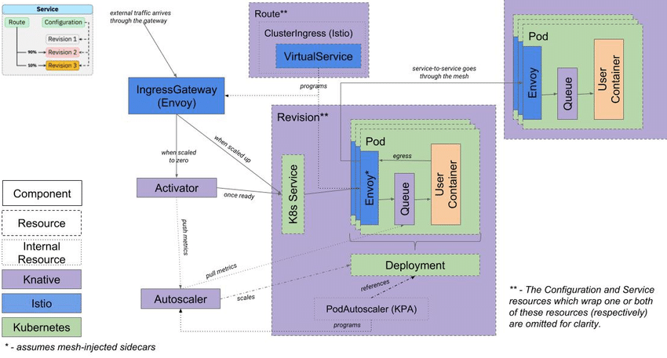
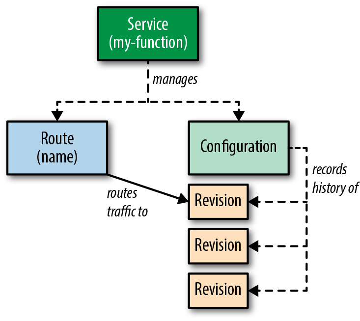

# KNative

**Knative** is an open source community project which adds components for deploying, running, and managing serverless, cloud-native applications to Kubernetes. The serverless cloud computing model can lead to increased developer productivity and reduced operational costs.



## Install

> Use `./init.sh` script to simplify the deployment.

### CLI

[https://github.com/knative](https://github.com/knative)

```bash
# https://knative.dev/docs/getting-started/quickstart-install/#install-the-knative-cli

# Install from brew
brew install kn

# Update existing one
brew upgrade kn

# Install from releases
export ARCH=$(case $(uname -m) in x86_64) echo -n amd64 ;; aarch64) echo -n arm64 ;; *) echo -n $(uname -m) ;; esac)
export OS=$(uname | awk '{print tolower($0)}')
export KNATIVE_VERSION=1.3.1
export KNATIVE_DL_URL=https://github.com/knative/client/releases/download/knative-v${KNATIVE_VERSION}
curl -LO ${KNATIVE_DL_URL}/kn-${OS}-${ARCH}
chmod +x kn-${OS}-${ARCH} && sudo mv kn-${OS}-${ARCH} /usr/local/bin/kn

# Verify the installation
kn version
```

### Istio

There are several `Service Mesh` technologies supported by Knative such as: `Istio`,  `Kourier` and `Contour`.

> The current [known-to-be-stable](https://knative.dev/docs/install/installing-istio/#before-you-begin) version of Istio tested in conjunction with Knative is `v1.12.` Versions in the 1.12 line are generally fine too.

```bash
# Remove traefik from cluster (Rancher Desktop)
kubectl -n kube-system delete helmcharts.helm.cattle.io traefik

# Helm Chart

## Clone specific Istio repository tag
git clone https://github.com/istio/istio.git
cd istio
git checkout 1.12.5

## Install Istio Operator
helm template /manifests/charts/istio-operator/ \
  --set hub=docker.io/istio \
  --set tag=1.12.5 \
  --set operatorNamespace=istio-operator \
  --set watchedNamespaces=istio-system | kubectl apply -f -

# [USED] Istio CLI (istioctl)
istioctl operator init --watchedNamespaces=istio-system --operatorNamespace=istio-operator --tag=1.12.5
```

`istio.yaml`

```yaml
apiVersion: install.istio.io/v1alpha1
kind: IstioOperator
metadata:
  name: istio-control-plane
  namespace: istio-system
spec:
  profile: default
  components:
    ingressGateways:
    - name: istio-ingressgateway
      enabled: true
```

Install `istio`

```bash
# Apply custom manifest
kubectl apply -f istio.yaml
```

### Serving

Serving allows to have multiple replicas with different versions and can be used concurrently.



Installation can be done using multiple ways, in this case `Knative operator` will be used.

```bash
# Install Knative Operator into `default` namespace (it cannot be changed)
export KNATIVE_VERSION=1.3.1
kubectl apply -f https://github.com/knative/operator/releases/download/knative-v$KNATIVE_VERSION/operator.yaml

# To install using yaml files
# https://platform9.com/blog/how-to-set-up-knative-serving-on-kubernetes/
```

Create a kubernetes [KnativeServing](https://knative.dev/docs/install/operator/configuring-with-operator/#examples) manifest.

`knative-serving.yaml`

```yaml
apiVersion: v1
kind: Namespace
metadata:
  name: knative-serving
---
apiVersion: operator.knative.dev/v1alpha1
kind: KnativeServing
metadata:
  name: knative-serving
  namespace: knative-serving
spec:
  version: 1.3.0
  # Maanifest can be fetched from different location in order
  manifests:
    - URL: https://github.com/knative/serving/releases/download/knative-v${VERSION}/serving-core.yaml
    - URL: https://github.com/knative/serving/releases/download/knative-v${VERSION}/serving-hpa.yaml
    - URL: https://github.com/knative/serving/releases/download/knative-v${VERSION}/serving-post-install-jobs.yaml
    - URL: https://github.com/knative/net-istio/releases/download/knative-v${VERSION}/net-istio.yaml
  config:
    domain:
      example.com: ""
    istio:
      local-gateway.knative-serving.knative-local-gateway: istio-ingressgateway.istio-system.svc.cluster.local
```

Install `knative-serving`

```bash
# Apply custom manifest
kubectl apply -f knative-serving.yaml
```

Verify the installation

```bash
# Get all posd
kubectl get pods --all-namespaces

# NAMESPACE         NAME                                                    READY   STATUS      RESTARTS   AGE
# istio-operator    istio-operator-7787689bf-szrdh                          1/1     Running     0          12m
# istio-system      istiod-7fbd46f6fb-56p9j                                 1/1     Running     0          9m30s
# istio-system      istio-ingressgateway-64df784c7d-9vn5m                   1/1     Running     0          9m17s
# istio-system      svclb-istio-ingressgateway-rktfv                        3/3     Running     0          9m17s
# default           knative-operator-55b8d65778-hfxdd                       1/1     Running     0          2m43s
# default           operator-webhook-9cff464c6-75l6p                        1/1     Running     0          2m44s
# knative-serving   domain-mapping-59fdc67c94-k4l7k                         1/1     Running     0          95s
# knative-serving   controller-658b47588b-46hj6                             1/1     Running     0          95s
# knative-serving   autoscaler-85748d9cf4-626dt                             1/1     Running     0          96s
# knative-serving   autoscaler-hpa-5c869c8d9-drppk                          1/1     Running     0          92s
# knative-serving   domainmapping-webhook-6df595d448-rkv8t                  1/1     Running     0          94s
# knative-serving   webhook-69fdbbf67d-mhqtj                                1/1     Running     0          93s
# knative-serving   storage-version-migration-serving-serving-1.3.0-nws5h   0/1     Completed   0          91s
# knative-serving   activator-855fbdfd77-5kxx7                              1/1     Running     0          96s
# knative-serving   net-istio-webhook-f96dbffb4-fx5fp                       1/1     Running     0          88s
# knative-serving   net-istio-controller-6b84bc75d6-lbg88                   1/1     Running     0          88s

# Get all services
kubectl get sva --all-namespaces

# NAMESPACE         NAME                         TYPE           CLUSTER-IP      EXTERNAL-IP     PORT(S)                                      AGE
# istio-operator    istio-operator               ClusterIP      10.43.113.129   <none>          8383/TCP                                     12m
# istio-system      istiod                       ClusterIP      10.43.198.168   <none>          15010/TCP,15012/TCP,443/TCP,15014/TCP        9m52s
# istio-system      istio-ingressgateway         LoadBalancer   10.43.176.79    192.168.1.138   15021:30411/TCP,80:31716/TCP,443:31160/TCP   9m40s
# default           operator-webhook             ClusterIP      10.43.241.126   <none>          9090/TCP,8008/TCP,443/TCP                    3m7s
# knative-serving   autoscaler-bucket-00-of-01   ClusterIP      10.43.129.162   <none>          8080/TCP                                     114s
# knative-serving   activator-service            ClusterIP      10.43.80.4      <none>          9090/TCP,8008/TCP,80/TCP,81/TCP              119s
# knative-serving   autoscaler                   ClusterIP      10.43.97.247    <none>          9090/TCP,8008/TCP,8080/TCP                   118s
# knative-serving   controller                   ClusterIP      10.43.244.135   <none>          9090/TCP,8008/TCP                            118s
# knative-serving   domainmapping-webhook        ClusterIP      10.43.114.101   <none>          9090/TCP,8008/TCP,443/TCP                    117s
# knative-serving   webhook                      ClusterIP      10.43.203.41    <none>          9090/TCP,8008/TCP,443/TCP                    116s
# knative-serving   autoscaler-hpa               ClusterIP      10.43.219.160   <none>          9090/TCP,8008/TCP                            115s
# istio-system      knative-local-gateway        ClusterIP      10.43.153.16    <none>          80/TCP                                       113s
# knative-serving   net-istio-webhook            ClusterIP      10.43.183.165   <none>          9090/TCP,8008/TCP,443/TCP                    110s
```

Install Istio features /(traceability, mTLS, metrics, routing, etc...)

```bash
# Enable `istio-injection` within the knative-serving namespace
kubectl label namespace knative-serving istio-injection=enabled

# Set PeerAuthentication to PERMISSIVE or STRICT on knative-serving
# In newer versions of Istio this is the default behavior
```

`knative-serving-pa.yaml`

```yaml
apiVersion: "security.istio.io/v1beta1"
kind: "PeerAuthentication"
metadata:
  name: "default"
  namespace: "knative-serving"
spec:
  mtls:
    mode: PERMISSIVE
```

### Create Service

When you create a `KService`, it creates:

* `Configuration`, which creates:
  * `Revision`, which creates:
    * Kubernetes `Deployment`, which creates:
      Kubernetes `ReplicaSet`, which creates:
        Kubernetes `Pods` based on replica count.
    * `PodAutoscaler`
* `Route`, which creates:
  * Kubernetes `Service`.

Create the Namespace and inject the sidecar

```bash
# Create namespace
kubectl create ns webapp

# Enable `istio-injection` within the webapp namespace
kubectl label namespace webapp istio-injection=enabled
```

Create following file

`hello-world.yaml`

```yaml
apiVersion: serving.knative.dev/v1
kind: Service
metadata:
  name: hello
spec:
  template:
    metadata:
      # This is the name of our new "Revision," it must follow the convention {service-name}-{revision-name}
      name: hello-world
    spec:
      containers:
        - image: gcr.io/knative-samples/helloworld-go
          ports:
            - containerPort: 8080
          env:
            - name: TARGET
              value: "World"
```

Create the knative servier

```bash
# Apply custom manifest
kubectl apply -n webapp -f hello-world.yaml

# Get the Knative Service info
kubectl get -n webapp kservice

# NAME    URL                                LATESTCREATED   LATESTREADY   READY   REASON
# hello   http://hello.webapp.example.com   hello-world     hello-world   True   

#         http://{SERVICE}.{NAMESPACE}.yourdomain.com

# To change the domain https://knative.dev/docs/serving/using-a-custom-domain/

k get all -n webapp

# NAME                          TYPE           CLUSTER-IP    EXTERNAL-IP               PORT(S)                                      # AGE
# service/hello-world-private   ClusterIP      10.43.8.56    <none>                    80/TCP,9090/TCP,9091/TCP,8022/TCP,8012/TCP   5m
# service/hello-world           ClusterIP      10.43.2.138   <none>                    80/TCP                                       5m
# service/hello                 ExternalName   <none>        istio-ingressgateway...   80/TCP                                       # 4m53s
# 
# NAME                                     READY   UP-TO-DATE   AVAILABLE   AGE
# deployment.apps/hello-world-deployment   0/0     0            0           5m
# 
# NAME                                               DESIRED   CURRENT   READY   AGE
# replicaset.apps/hello-world-deployment-b746bf7fc   0         0         0       5m
# 
# NAME                                      LATESTCREATED   LATESTREADY   READY   REASON
# configuration.serving.knative.dev/hello   hello-world     hello-world   True    
# 
# NAME                                URL                               LATESTCREATED   LATESTREADY   READY   REASON
# service.serving.knative.dev/hello   http://hello.webapp.example.com   hello-world     hello-world   True    
# 
# NAME                                       CONFIG NAME   K8S SERVICE NAME   GENERATION   READY   REASON   ACTUAL REPLICAS   DESIRED REPLICAS
# revision.serving.knative.dev/hello-world   hello                            1            True             0                 0
# 
# NAME                              URL                               READY   REASON
# route.serving.knative.dev/hello   http://hello.webapp.example.com   True    
```

Add entry into `/etc/host/`

```bash
...
127.0.0.1 hello.webapp.example.com
```

Test the service using url http://hello.webapp.example.com

```bash
# After executing previous URL, knative will detect the action by the `activator` and will trigger the `autoscaler`

# NAME                                         READY   STATUS    RESTARTS   AGE
# pod/hello-world-deployment-b746bf7fc-zlhnf   3/3     Running   0          14s
# 
# NAME                          TYPE           CLUSTER-IP    EXTERNAL-IP              PORT(S)                                      AGE
# service/hello-world-private   ClusterIP      10.43.8.56    <none>                   80/TCP,9090/TCP,9091/TCP,8022/TCP,8012/TCP   8m45s
# service/hello-world           ClusterIP      10.43.2.138   <none>                   80/TCP                                       8m45s
# service/hello                 ExternalName   <none>        istio-ingressgatewa...   80/TCP                                       8m38s
# 
# NAME                                     READY   UP-TO-DATE   AVAILABLE   AGE
# deployment.apps/hello-world-deployment   1/1     1            1           8m45s
# 
# NAME                                               DESIRED   CURRENT   READY   AGE
# replicaset.apps/hello-world-deployment-b746bf7fc   1         1         1       8m45s
```